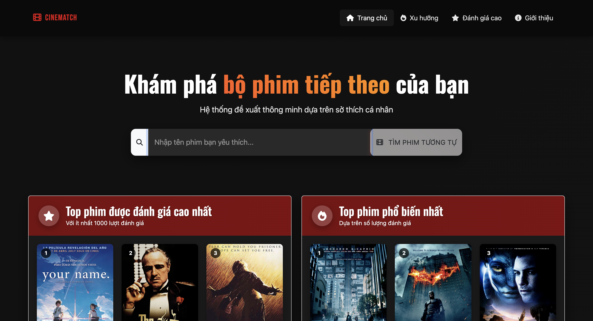
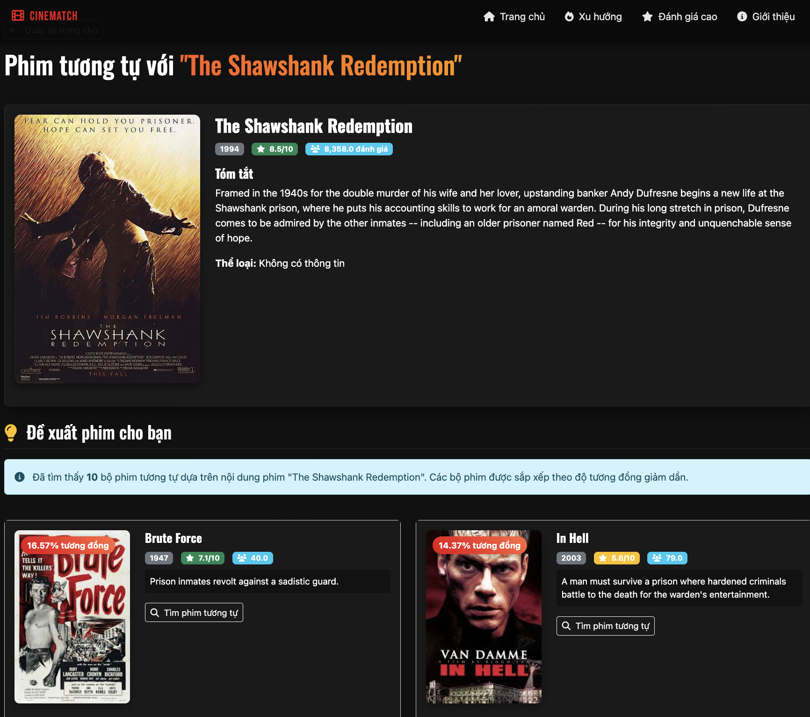
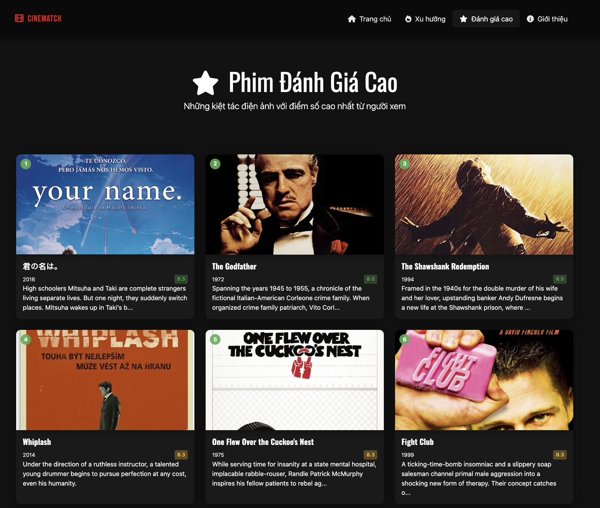

# 🎬 CineMatch - Hệ thống đề xuất phim dựa trên nội dung

<p align="center">
  
</p>

---

## 📌 Giới thiệu

**CineMatch** là một hệ thống đề xuất phim thông minh sử dụng các thuật toán trí tuệ nhân tạo để phân tích nội dung phim và đưa ra những đề xuất phù hợp nhất với sở thích của bạn.

---

## 🚀 Tính năng chính

- 🔍 **Tìm kiếm phim theo tên** với gợi ý thông minh
- 🎞️ **Đề xuất phim tương tự** dựa trên nội dung của phim đã chọn
- 🌟 **Danh sách phim nổi bật** được đánh giá cao
- 📈 **Phim xu hướng** đang được quan tâm
- 💻 **Giao diện người dùng hiện đại** phong cách Netflix, responsive trên mọi thiết bị

---

## 🎨 Giao diện ứng dụng

<p align="center">
  
  <br/><em>Trang chủ - Tìm kiếm và khám phá phim</em>
</p>

<p align="center">
  
  <br/><em>Trang đề xuất phim tương tự</em>
</p>

<p align="center">
  
  <br/><em>Trang phim xu hướng & đánh giá cao</em>
</p>

---

## 🧠 Công nghệ sử dụng

### 🔧 Back-end
- **Python**: Ngôn ngữ chính
- **Flask**: Web framework
- **Pandas, NumPy**: Xử lý dữ liệu
- **Scikit-learn**: Thuật toán TF-IDF & Cosine Similarity

### 🎨 Front-end
- **HTML/CSS**, **JavaScript**
- **Bootstrap 5**, **Font Awesome**, **Google Fonts**

---

## 📁 Cấu trúc dự án

```
Movie_Recommendation_System/
├── .gitattributes                         # Cấu hình Git attributes
├── data_preprocessing.ipynb               # Notebook xử lý dữ liệu
├── requirements.txt                       # Danh sách thư viện cần thiết
├── render.yaml                            # Cấu hình deploy Render
├── Data/                                  # Thư mục chứa dữ liệu gốc
│   ├── Data_Movies_ok.csv                 # Dữ liệu phim đã xử lý
│   ├── Data_Movies.csv                    # Dữ liệu phim gốc
│   └── similarity_matrix.npz             # Ma trận tương đồng đã tính toán
├── movie_recomender/                      # Thư mục chứa mã nguồn chính
│   ├── app.py                             # Flask application chính
│   ├── recommender.py                     # Module xử lý đề xuất phim
│   ├── matrix_loader.py                   # Module tải ma trận tương đồng
│   ├── Procfile                           # Cấu hình Gunicorn cho Render
│   ├── data/                              # Dữ liệu cho ứng dụng
│   │   └── Data_Movies_ok.csv
│   ├── static/                            # Tài nguyên tĩnh
│   │   ├── style.css
│   │   ├── data/
│   │   │   └── movie-poster.json
│   │   ├── images/
│   │   └── posters/
│   └── templates/                         # Template HTML
│       ├── index.html
│       ├── recommendations.html
│       ├── trending.html
│       ├── top_rated.html
│       └── about.html
└── Pic/                                   # Hình ảnh minh họa
```

---

## 🧩 Quy trình hoạt động

### Tổng quan hệ thống

<p align="center">
  
  <br/><em>Tổng quan kiến trúc hệ thống CineMatch</em>
</p>

<p align="center">
  
  <br/><em>Quy trình xử lý dữ liệu phim</em>
</p>

1. **Tiền xử lý dữ liệu**
   - Làm sạch, loại bỏ giá trị thiếu, chuẩn hóa

2. **Xây dựng mô hình**
   - Vector hóa nội dung bằng **TF-IDF**
   - Tính **Cosine Similarity** giữa các phim
   - Lưu ma trận tương đồng để tối ưu hiệu suất

3. **Đề xuất**
   - Trả về danh sách phim có nội dung gần nhất với phim được chọn

<p align="center">
  
  <br/><em>Quy trình đề xuất phim</em>
</p>

<p align="center">
  
  <br/><em>Kiến trúc chi tiết hệ thống</em>
</p>

<p align="center">
  
  <br/><em>Kết quả hoạt động của hệ thống</em>
</p>

---

## 📐 Thuật toán Cosine Similarity

<p align="center">
  
  <br/><em>Minh họa độ tương đồng Cosine</em>
</p>

<p align="center">
  
  <br/><em>Ma trận tương đồng giữa các phim</em>
</p>

Hệ thống sử dụng **Cosine Similarity** để đo độ tương đồng giữa các phim dựa trên vector TF-IDF của mô tả nội dung:

$$\text{similarity}(A, B) = \cos(\theta) = \frac{A \cdot B}{\|A\| \|B\|}$$

---

## ⚙️ Cài đặt và chạy ứng dụng

### ✅ Yêu cầu
- Python 3.8+
- Pip

### 🔨 Các bước triển khai

```bash
# 1. Clone repo
git clone <repository-url>
cd Movie_Recommendation_System

# 2. Cài đặt thư viện
pip install -r requirements.txt

# 3. Chạy ứng dụng
cd movie_recomender
python app.py
```

➡️ Mở trình duyệt và truy cập: `http://localhost:6789`

---

## 🌟 Tính năng nổi bật

### 1. Hệ thống đề xuất nội dung
- Sử dụng **TF-IDF** và **Cosine Similarity** để tìm phim tương tự

### 2. Tìm kiếm thông minh
- Tìm kiếm realtime với hình ảnh minh họa rõ ràng

### 3. Hiệu suất cao
- Dữ liệu lưu dưới dạng sparse matrix
- Tải ma trận từ Google Drive nếu thiếu
- Dùng caching để tăng tốc phản hồi

### 4. UI hiện đại
- Thiết kế kiểu **Netflix**
- Sử dụng AOS cho hiệu ứng mượt
- Responsive toàn diện

---

## 📊 Thống kê dữ liệu

| Thông tin             | Giá trị              |
|----------------------|----------------------|
| Số lượng phim        | 11.756               |
| Giai đoạn phát hành  | 1085 - 2020          |
| Điểm đánh giá TB     | 6.3/10               |
| Lượt đánh giá TB     | 396/phim             |

---

## 👤 Tác giả

- **Đỗ Ngọc Phi** - MSSV: 2221050848
- **Nguyễn Minh Quân** - MSSV: 2221050125
- **Đào Anh Tú** - MSSV: 2221050231
- **GVHD**: Thầy Đặng Văn Nam, Cô Dương Thị Hiền Thanh
  _Khoa CNTT - Trường ĐH Mỏ - Địa chất_

---

## 📚 Tài liệu tham khảo

- Bài giảng "Machine Learning - Chương 5: Recommender Systems"
- Tài liệu chính thức của Scikit-learn
- Nguồn học thuật về TF-IDF & Cosine Similarity

---

## 📝 Ghi chú cuối

Dự án **CineMatch** là ví dụ tiêu biểu về việc tích hợp học máy và phát triển web. Các yếu tố như cấu trúc rõ ràng, hiệu suất tối ưu, giao diện thân thiện giúp dự án không chỉ tốt về mặt kỹ thuật mà còn hoàn thiện về trải nghiệm người dùng.

---

⭐ Nếu bạn thấy dự án hữu ích, hãy ⭐ trên GitHub nhé!